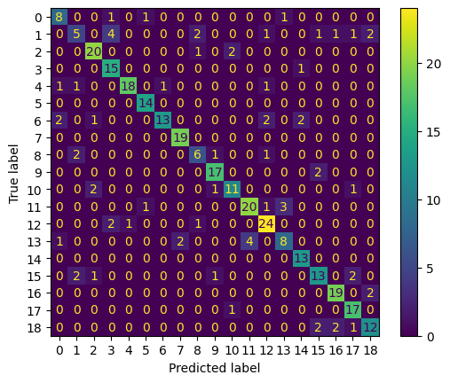

# iris-task

## Install the requirements to run the notebooks
```bash
pip install -r notebooks/requirements.txt
```

## Pull the large files locally
```bash
git lfs pull
```

# arXiv Dataset and Recent Research

This dataset shared by Cornell University is rich not only in size but in the range of NLP tasks that it can be used for. Reports with this dataset cover tasks from different disciplines like unsuperrvised analisys of scientific literature, classification - multiclass and multilabel, semantic and mathematical parsing, etc. Some of the most impactfull papers are mentioned below:


[Ginev et al. (2019)](https://arxiv.org/pdf/1908.10993)  framed arXiv papers not merely as documents but as rich sources of scientific statements. Instead of focusing on whole-paper classification, they introduced the task of scientific statement classification, breaking articles into semantically meaningful units and showing that arXiv provides sufficient linguistic diversity for learning fine-grained distinctions across scientific discourse. Their work demonstrated that the dataset supports granular semantic tasks beyond simple category prediction.

[Kandimalla et al. (2020)](https://arxiv.org/pdf/2007.13826)  shifted attention to subject-area classification at scale. Using deep attentive neural networks on millions of abstracts, they demonstrated how arXiv’s breadth across physics, mathematics, computer science, and more enables robust modeling of disciplinary boundaries. Their results showed that deep architectures can capture domain-specific writing styles, and that the dataset is sufficiently large to support high-capacity models. This work helped cement arXiv as a benchmark for multi-class document classification.

[Scharpf et al. (2021)](https://arxiv.org/pdf/2109.00954) explored classification in STEM fields using both textual content and mathematical formulas, arguing that arXiv is uniquely suited for multimodal scientific NLP. In their work, formulas were treated as first-class linguistic objects, and the study demonstrated how pairing text with symbolic structure can improve classification while providing explanations tied to mathematical entities. This reframed arXiv as a multimodal resource rather than a purely textual one.


[Schopf et al. (2024)](https://arxiv.org/pdf/2410.05770) investigate few-shot multi-label classification, addressing a challenge often overlooked: many scientific papers straddle multiple research areas. Their work demonstrates that arXiv’s hierarchical, overlapping subject categories make it ideal for multi-label learning. By using few-shot methods, they showed how models can generalize across hundreds of categories with minimal supervision, emphasizing arXiv’s value for low-resource and transfer-learning scenarios.

Most recently, [Rahman et al. (2025)](https://arxiv.org/pdf/2510.05495) revisite large-scale multi-class classification, but with an emphasis on practical recommendation and automated sorting systems.


# The experiment in this setup is in the scope of fine-tuning BERT-like model on this dataset. 19 Parent Categories are used in the experiment.
1 Exploratoty analisys of the dataset are performed in this notebook . In the same notebook the dataset is processed and splitted into train test and validation splits in 80/10/10 proportion.
2. In the "fine-tuning.ipynb" notebook is the procedure to tokenize and train a BERT-like model
3. The trained model is then tested on unseen data in 

This is a legend of the Classes and their IDs in the results:


'astro-ph': 5,
 'cond-mat': 3,
 'cs': 10,
 'econ': 18,
 'eess': 17,
 'gr-qc': 4,
 'hep-ex': 7,
 'hep-lat': 14,
 'hep-ph': 0,
 'hep-th': 6,
 'math': 2,
 'nlin': 8,
 'nucl-ex': 13,
 'nucl-th': 11,
 'physics': 1,
 'q-bio': 9,
 'q-fin': 16,
 'quant-ph': 12,
 'stat': 15


Results for multi-class classification of Arxiv titles and abstracts using 19 Classes:

                precision    recall  f1-score   support

           5       0.88      1.00      0.93        14
           3       0.68      0.94      0.79        16
          10       0.79      0.73      0.76        15
          18       0.75      0.71      0.73        17
          17       0.77      0.94      0.85        18
           4       0.95      0.82      0.88        22
           7       0.90      1.00      0.95        19
          14       0.81      1.00      0.90        13
           0       0.67      0.73      0.70        11
           6       0.93      0.65      0.76        20
           2       0.83      0.87      0.85        23
           8       0.60      0.60      0.60        10
          13       0.67      0.53      0.59        15
          11       0.83      0.80      0.82        25
           1       0.50      0.29      0.37        17
           9       0.85      0.89      0.87        19
          16       0.86      0.90      0.88        21
          12       0.80      0.86      0.83        28
          15       0.72      0.68      0.70        19

    accuracy                           0.80       342
   macro avg       0.78      0.79      0.78       342
weighted avg       0.79      0.80      0.79       342




From the confusion matrix can be seen that there is one class that is wrongly classified most of the time. 
The problematic label has id 1 and is maped to the physics class. 
It is predicted 4 times as 3 which maps to cond-mat class or "Conditional matter" - a subcategory of physics as we can see in the taxonomy [here](https://arxiv.org/category_taxonomy) 
This is probably due to the fact that these two classes are very similar in content.
Other misclassifications of Physics (id 1) are not as frequent as these 4 misclassifications to Cond-mat (id 3).
The other classes are classified with very high precision and recall with some room for improvements.

TODO:

1. Experiment with the taxonomy by merging or adding classes in the model. From what is seen 'nucl-ex' with ID 13 and'nucl-th' with ID 11 are mistaken with each other and thus can be merged into one class 'nuclear physics'.
2. More data can be used for the training as well.
3. Hyperparameter tuning.
4. Test different BERT models like SciBERT by Beltagy et. al. - https://aclanthology.org/D19-1371.pdf.
5. Train multi-label BERT classifier


